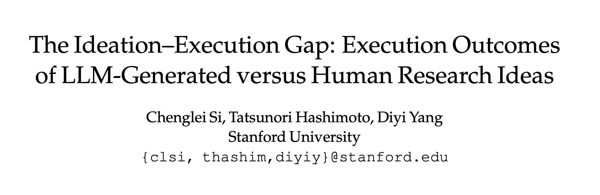

<h1 align="center">
  <b>Research Ideation Agent & Human Study Data</b><br>
  <b>by Stanford NLP</b><br>
</h1>




This repo contains three major components:

1. Implementation of the research ideation agent used in our ideation study "Are LLMs Better than Experts on Generating Novel Research Ideas? A Large-Scale Human Study with 100+ NLP Researchers". 

2. All the ideas and reviews collected from our ideation study "Are LLMs Better than Experts on Generating Novel Research Ideas? A Large-Scale Human Study with 100+ NLP Researchers". Based on evaluation results by 79 expert reviewers, the ideas produced by our LLM agent were rated as more novel than those generated by human experts. 

3. All the executed papers, codebases, and corresponding reviews for the 43 executed ideas in our execution study "The Ideation–Execution Gap: Execution Outcomes of LLM-Generated versus Human Research Ideas". Comparing the review scores of the same ideas before and after execution, the scores of the LLM-generated ideas decrease significantly more than expert-written ideas on all evaluation metrics. When comparing the aggregated review scores from the execution study, we even observe a flip in rankings where human ideas score higher than LLM ideas on most metrics. 


## Table of Contents

1. [Ideation Agent Implementation](#ideation-agent-implementation)
2. [Ideation Study Data](#ideation-study-data)
3. [Execution Study Data](#execution-study-data)

## Ideation Agent Implementation

The input to our agent is a research topic described as a natural language sentence; and the output is a list of project proposals ranked by their estimated quality. The project proposals are designed to be very detailed such that a student can directly follow each step in the proposal to execute the entire project.

Our agent pipeline consists of the following modules:
(1) Related Paper Search;
(2) Grounded Idea Generation;
(3) Idea Deduplication;
(4) Project Proposal Generation;
(5) Project Proposal Ranking;
(6) Project Proposal Filtering.

These modules are designed to be run sequentially as an end-to-end idea generation pipeline. Each module can also be run separately as standalone research assistance tools. We describe how to run each module as well as the entire pipeline below.

1. [Setup](#setup)
2. [Related Paper Search](#related-paper-search)
3. [Grounded Idea Generation](#grounded-idea-generation)
4. [Idea Deduplication](#idea-deduplication)
5. [Project Proposal Generation](#project-proposal-generation)
6. [Project Proposal Ranking](#project-proposal-ranking)
7. [Project Proposal Filtering](#project-proposal-filtering)
8. [End-to-End Pipeline](#end-to-end-pipeline)


### Setup

You can set up the environment by running the following commands:

```bash
git clone https://github.com/NoviScl/AI-Researcher.git
cd AI-Researcher
conda create -n ai-researcher python=3.10
conda activate ai-researcher
pip install -r requirements.txt
```

Create `keys.json` and store it in the project directory. The file should look like this:

```
{
    "api_key": "Your OpenAI API Key",
    "organization_id": "Your OpenAI Organization ID (Optional)",
    "s2_key": "Your Semantic Scholar API Key (Optional)",
    "anthropic_key": "Your Anthropic API Key"
}
```

### Related Paper Search

The related work search module will iteratively propose search queries and search through the Semantic Scholar API. We then use an LLM to score the relevance of retrieved papers for reranking. The module takes a topic description or an idea as input and returns a list of the most relevant papers as output.

Example usage (finding related papers for a given topic):
```
cd ai_researcher 
bash scripts/lit_review.sh 
```

The `max_paper_bank_size` is a hyperparameter to control when to stop the paper search process (until the specified number of papers has been retrieved). The generated search queries as well as the ranked papers will be stored in the specified cache file. The cache file can be used as part of the input to the idea generation module. We used `max_paper_bank_size=120` for the experiments in our paper and used `max_paper_bank_size=50` in this demo example. Running this demo example costs $0.51. 


### Grounded Idea Generation

The idea generation module takes a topic description and optionally a list of relevant papers as input, and returns a list of generated ideas as the output. 

Example usage: 
```
cd ai_researcher 
bash scripts/grounded_idea_gen.sh
```

Due to the max output length constraint, we recommend generating ideas in batches of 5 (`ideas_n=5`) and running the script multiple times with different seeds to collect a larger set of ideas. You can set `RAG` to either `True` or `False` to turn on or off retrieval augmentation where we ground the idea generation on retrieved papers. We generated 4K ideas for each topic in our paper. In the demo example, we only generate 20 seed ideas, which costs $0.85.

### Idea Deduplication

We do a round of deduplication to remove similar ideas generated by the grounded idea generation module. We set a threshold of `similarity_threshold=0.8` cosine similarity based on the sentence embeddings to determine if two ideas are similar. The embedding is from the `sentence-transformers` library so this step doesn't cost any API credits to run.

Example usage:
```
cd ai_researcher
bash scripts/idea_dedup.sh
```

### Project Proposal Generation

Next, we expand each seed idea into a detailed project proposal. 

Example usage:
```
cd ai_researcher
bash scripts/project_proposal_gen.sh
```

Since the project proposals are long, each generation takes an average of $0.3 and running the whole demo example here takes $2.9.

### Project Proposal Ranking

We rank all the generated project proposals by using an LLM ranker. 

Example usage:
```
cd ai_researcher
bash scripts/project_proposal_ranking.sh
```

The output will be a json file storing the score of each project proposal, which you can use to rank the proposals. The demo example costs $0.74 to rank 10 project proposals for 5 rounds of scoring.

### Project Proposal Filtering (Optional)

If you wish, you can also apply the last filtering step where we check whether each project proposal is novel and feasible. For novelty check, we will retrieve the most similar papers to the generated project proposal and compare them one by one. The project proposal will be filtered as long as it's judged as the same as any of the retrieved papers by the LLM.

Example usage:
```
cd ai_researcher
bash scripts/project_proposal_filter.sh
```

All the project proposals that passed the filters will be stored in the specified output cache directory, along with the retrieved papers used for the novelty check. Note that this filtering step is rather expensive (it costs $1.9 to check through each project proposal in this demo example). You can lower the costs by reducing the number of retrieved papers for novelty check.

### End-to-End Pipeline

We also provide a script that runs the entire pipeline to generate the project proposals based on the given research topic.

Example usage:
```
cd ai_researcher
bash scripts/end_to_end.sh
```


## Ideation Study Data

We release the full set of reviews (including both numerical scores and free-text rationales) collected in the `reviews_ideation` directory, along with all the scripts that we used to do the stistical tests in the paper. 
All reviewer names have been removed to protect their information.
We also release all ideas used in the ideation study:

- All the ideas in the Human Condition can be downloaded from [this link](https://drive.google.com/file/d/1Z2Nd7WNNks-eCoqUgPzx1_ovYqU8OiPx/view?usp=sharing).

- All the ideas in the AI Condition can be downloaded from [this link](https://drive.google.com/file/d/1AFjSUCTj4wL081R2b17nVuNSs7xvzh8F/view?usp=sharing).

- All ideas in the AI + Human Rerank Condition can be downloaded from [this link](https://drive.google.com/file/d/15r3TzFd-6dPXdSMx0shZ4q3ljDOEzp8I/view?usp=sharing).

## Execution Study Data

We release the full set of reviews on all the executed projects in the `reviews_execution` directory.

All the edited ideas (with executors' proposed changes), papers, and codebases can be downloaded from [this link](https://drive.google.com/file/d/1PpxeTz_-xHHcMXyUwv1Oed1avTaiD5vv/view?usp=sharing).

We also include the scripts that we used to do the statistical tests in the paper.

## Citation

Please cite our papers and star this repo if you find our work useful, thanks! Feel free to contact clsi@stanford.edu or open an issue if you have any questions.

```bibtex
@inproceedings{Si2025Can,
  title={{Can LLMs Generate Novel Research Ideas? A Large-Scale Human Study with 100+ NLP Researchers}},
  author={Chenglei Si and Diyi Yang and Tatsunori Hashimoto},
  year={2025},
  booktitle={ICLR},
  url={https://arxiv.org/abs/2409.04109}
}

@article{Si2025Gap,
  title={{The Ideation–Execution Gap: Execution Outcomes of LLM-Generated versus Human Research Ideas}},
  author={Chenglei Si and Tatsunori Hashimoto and Diyi Yang},
  year={2025},
  journal={ArXiv},
}
```